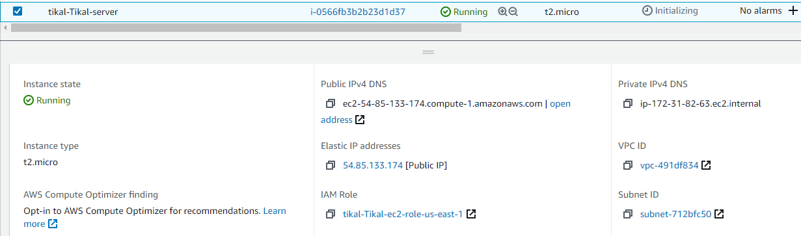
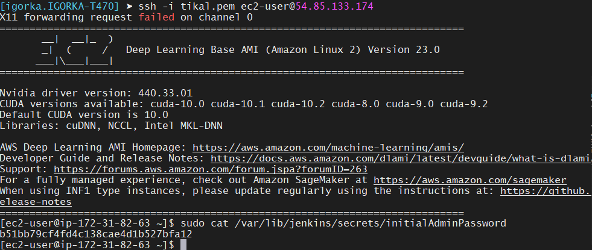
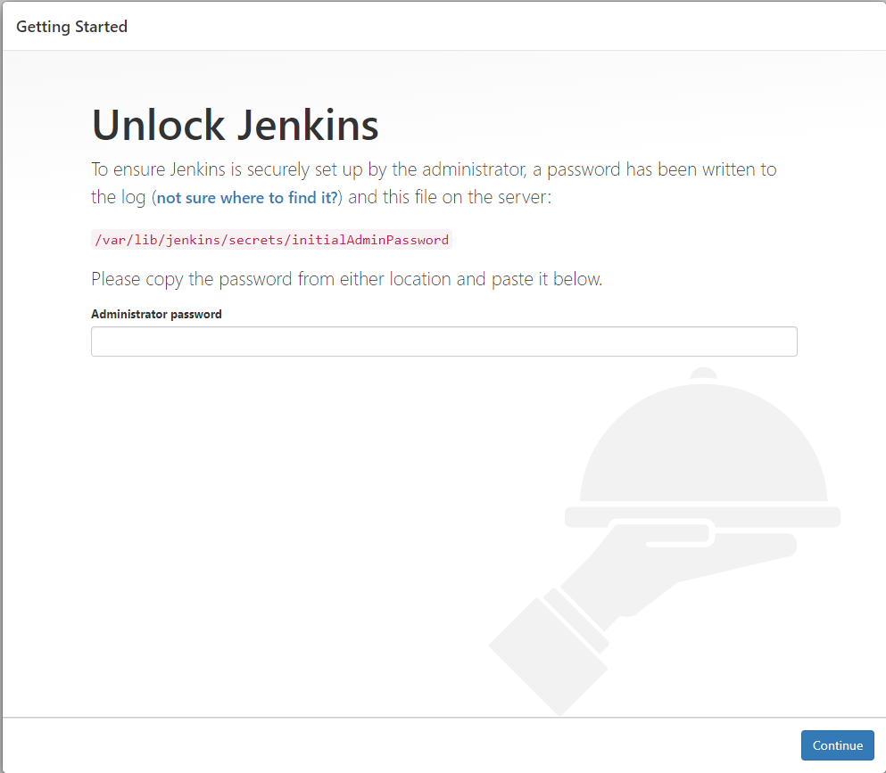
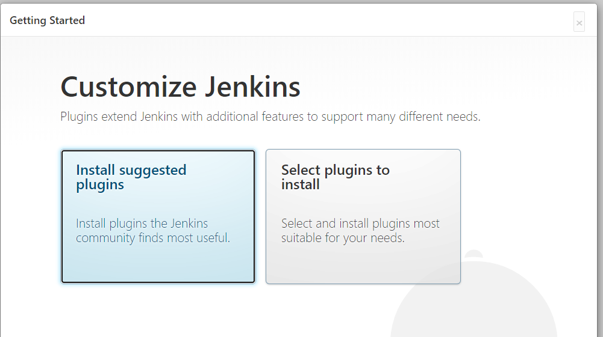
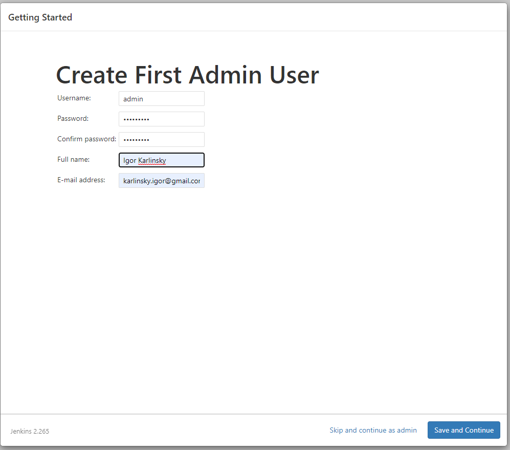
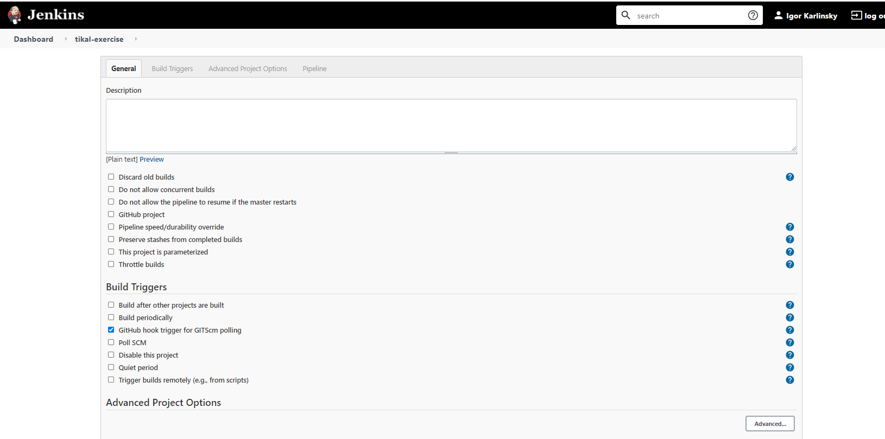
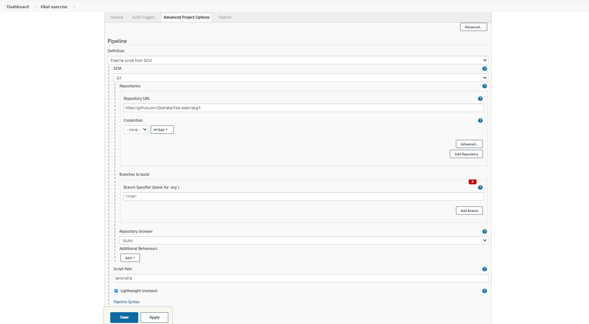
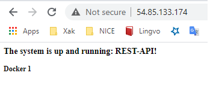

# Tikal exercise 

[](https://travis-ci.com/Goshaka/tikal-exercise)

# Prerequisites:
 - Ubuntu server (Ubuntu 20.x.x LTS)
 - AWS free tier account
 - AWS default vpc
 - SSH client
 - Browser
 - git client should be installed on Ubuntu server
 - AWS access & secrets keys should be generated
 - AWS Keys pair with KeyName - "tikal"


### Jenkins installation

Login to your Ubuntu server

Install the Ansible with requirements

```sh
$sudo apt update && sudo apt install -y python3 && sudo apt install -y python3-pip  && sudo pip3 install boto3 && sudo pip3 install ansible
$ echo "export PATH=$PATH:~/.local/bin" >> ~/.bashrc && . ~/.bashrc
```

Download exercise solution files from github

```sh
$  git clone https://github.com/Goshaka/tikal-exercise.git  
```

Create jenkins ec2 server by execute ansible playbook tikal.yml 

```sh
$  cd tikal-exercise/  
$  ansible-playbook tikal.yml -e @tikal-vars.yml -e aws_access_key='your_aws_access_key' -e aws_secret_key='your_aws_secret_key' -e YourInternetIP='YourInternetIP'
```

### Jenkins pipeline creation

After the Jenkins server will be created and UP
Go to AWS console EC2 service and find out instance public IP



Open chrome browser or other one and put into address bar <Jenkins Instance public IP>:8080
 


Login by ssh to jenkins ec2 instace 

```sh

$   ssh -i <pem file location>/tikal.pem ec2-user@54.85.133.174 "sudo cat /var/lib/jenkins/secrets/initialAdminPassword"

```


Copy output of the "cat" command and put to Jenkins login page

Login to jenkins and unlock jenkins 




Install suggested plugins




Create new user



Create the Jenkins Pipeline Job


Configure new job according to the following screenshots



Put git https url "https://github.com/Goshaka/tikal-exercise.git" into "Repository Url" field 




Open docker rest API




